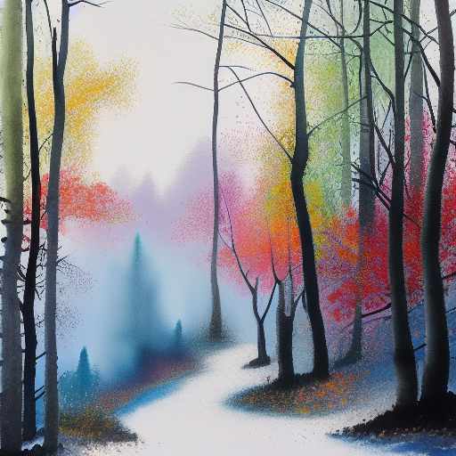

# plakat

[](https://crates.io/crates/plakat)
[](https://github.com/vulogov/plakat/releases/latest)
[](https://crates.io/crates/plakat)
[](https://unlicense.org/)

> **v6.11.0 — quality, in depth (RFC QUALITY-2)**: finishes the three `naturalize` deferrals. **Hi-res fix** — `generate --hires <factor>` (and `--quality high`) runs a tile-ControlNet upscale-diffuse after generation, injecting *real coherent detail* (fixes cloud-foliage, dissolving backgrounds, incoherent geometry that grain can't touch); order is gen → hires → naturalize → etch. **Full re-etch** — `naturalize` on a plakat-etched image now re-embeds a fresh **L1** pixel mark into the naturalized pixels and chains the source as `parent`, so `doctor --if-plakat` resolves it as a **valid `generated` etch** (not a stale mark); `--no-reetch` writes a clean output, and a never-etched input stays un-etched. **AI-tell ranking** (weight-free) — `rank --ai-tells` lists the least-AI-looking first, and `generate --keep-best K --ai-tells` prunes a batch on *aesthetic − λ·ai_tell* to the most human-looking frames. [Release notes →](https://github.com/vulogov/plakat/releases/tag/v6.11.0) · [Guide →](Documentation/QUALITY.md)
>
> **v6.10.0 — `plakat naturalize` (make it read human-sourced)**: reduce the "AI-generated" fingerprint of an image (RFC QUALITY-1). A weight-free **analog post-pass** — film grain · chromatic aberration · vignette · bloom · a *desaturating* film grade — breaks the too-clean, over-saturated digital look (realism, **not** vintage). **Content focus qualifiers** pre-tune it to a subject's tell — `--people` (waxy skin), `--sky` (banding), `--vegetation` (cloud-foliage mush), `--cityscape`, `--landscape`, `--sea`/`--river`, `--mechanics`, `--household` — all combining. **Corrective focuses** (model-backed) fix what grain can't: `--geometry`/`--anatomy` (img2img re-resolve) and `--no-twins` (detect + inpaint duplicate faces). Plus `--designature` (dissolve a foreign ghost-signature smudge), a `--quality low|medium|high` generation preset (bundles CFG-rescale/FreeU/PAG/dynamic-threshold/ADetailer), and `generate --naturalize` / scenario `naturalize:` passes that **preserve the `--etch` provenance**. [Release notes →](https://github.com/vulogov/plakat/releases/tag/v6.10.0) · [Guide →](Documentation/QUALITY.md)
>
> **v6.9.0 — `plakat product`**: the flagship (RFC PRODUCT-1). Turn a **subject** — a cutout, a photo, or a text prompt — into a studio **product-shot / packshot**: the subject on a controlled background (white / grey sweep / gradient / a generated scene), **grounded** with a physically-plausible contact shadow and floor reflection derived from its alpha, at a chosen camera angle, optionally relit to a named lighting rig (IC-Light). A packshot is *structured data* — the same rig and grounding reproduce across a whole catalog. **`product sheet`** tiles a subject's angles into a labelled contact sheet; **`product turntable`** sweeps the key light. The grounding / sweep / composite half is **weight-free** — a supplied cutout → a sellable shot with no GPU; only relight + subject-generation need a model. Wired everywhere: scenario `type: product`, `compile`, Bund `plakat.product.*`, `plakat::api::Product`. Fully additive. [Release notes →](https://github.com/vulogov/plakat/releases/tag/v6.9.0) · [Guide →](Documentation/PRODUCT.md)
>
> **v6.8.2 — `plakat comic` reference-lock, finished**: closes the three 6.8.1 deferrals. **Multi-character panels** now face-lock too — detected faces are matched to the `chars` list by reading-order position (left→right, or right→left for `rtl`), so a two-shot keeps *both* identities. **Scene-art reuse**: label a panel with `id:` and another `reuse: "@id"` renders it as the **exact** same image, book-wide (an establishing shot that repeats identically, not a re-generated recurrence). And **`--restore-faces`** runs a restore-faces refine over panels whose swapped face is small (distant / group shots) to crisp the detail. All best-effort on top of the face-swap weights; the reuse/id half is weight-free. [Release notes →](https://github.com/vulogov/plakat/releases/tag/v6.8.2) · [Guide →](Documentation/COMIC.md)
>
> **v6.8.1 — `plakat comic` goes multi-page**: a comic strip spans pages that share a cast, style, and engine while the panels and dialogue change. A `ComicSpec` gains `pages: [...]` (the top-level cast/style/model is the shared **world** propagated to every page → `page_00.png, page_01.png, …`), a named `scenes: { alley: "…" }` library that a panel references with `@alley` so a setting recurs, and `extends: "series.hjson"` to inherit a base spec. **Reference-lock** (`comic cast` + `render --lock`) renders each character once and **face-swaps** that reference onto every single-character panel (SCRFD+ArcFace+inswapper) so the same face holds across pages — beyond description-level drift — plus a `style_lora` that locks the look book-wide. The multi-page/scenes/extends half is weight-free. [Release notes →](https://github.com/vulogov/plakat/releases/tag/v6.8.1) · [Guide →](Documentation/COMIC.md)
>
> **v6.8.0 — `plakat comic`**: the flagship (RFC COMIC-1). A small HJSON `ComicSpec` becomes a **lettered, multi-panel comic page** — a panel grid, per-panel **scene art**, a **recurring cast** whose identity holds across panels (a `persona:` member compiles through the deterministic persona layer; a `describe:` member is seed-locked), and **speech balloons + captions** placed and lettered over the art. The balloon algorithm is the novel piece: fit the largest legible box → place it in open space (off detected faces, non-overlapping, biased to the reading corner) → draw one of four kinds (speech · thought · shout · caption) with a tail toward the speaker. The **weight-free half** (layout · balloons · composite) needs no GPU — bring your own panels with `comic layout/letter --panels <dir>`; only `comic render` generates the art, and lettering rides an asset-free all-caps bitmap face. Wired everywhere: scenario `type: comic`, `compile`, Bund `plakat.comic.*`, `plakat::api::Comic`. Fully additive. [Release notes →](https://github.com/vulogov/plakat/releases/tag/v6.8.0) · [Guide →](Documentation/COMIC.md)
>
> **v6.7.0 — provenance etching (`--etch` / `doctor --if-plakat`)**: opt-in `--etch` writes a 64-bit provenance id into images plakat produces by four independent evidence layers — an **L0** manifest (PNG chunk + sidecar), an **L1** pixel etch (a spread-spectrum DCT-QIM mark surviving transcode/rescale), an **L2** latent Fourier-ring mark, and an **L3** CLIP fingerprint (a local store that matches on *semantics*). `plakat doctor --if-plakat <IMAGE>` reads whatever survived into a **graded verdict** with a p-value — `generated` / `derived` / `probable-derivative` / `inconclusive` / `no-evidence` — degrading gracefully rather than off a cliff. Honest by design: it's verifiable through incidental editing, format churn, rescaling, and moderate generative edits — **not** a defence against a determined remover. Off by default; the module is always compiled. [Release notes →](https://github.com/vulogov/plakat/releases/tag/v6.7.0) · [Guide →](Documentation/ETCH.md)
>
> **v6.6.0 — `plakat texture` engine interop**: one `texture export --engine gltf|unreal|unity-hdrp|godot|materialx|plakat` picks the naming + packing + material document in a single flag — a **complete glTF 2.0** material (with **`KHR_materials_anisotropy`** driven by the brushed-metal flow map), a **MaterialX** (`.mtlx`) `standard_surface` for USD/Arnold/Substance, and the **Unity HDRP mask map** (which packs the same data *differently* from ORM: R=metal/G=AO/B=detail/A=smoothness). The packing conventions live in one verified table so a material drops into each engine correctly. Weight-free. [Release notes →](https://github.com/vulogov/plakat/releases/tag/v6.6.0) · [Guide →](Documentation/TEXTURE.md)
>
> **v6.5.0/6.5.1 — `plakat texture` layout: trim sheets & decals**: compose several materials into one banded **trim-sheet atlas** (each strip tiling along its run axis) with a `trim.json` UV-region sidecar, and stamp **decals** — alpha-masked overlays (a crack, rust streak, sign) — onto a base material, blending the normal via **Reoriented Normal Mapping** so decal detail rides the base slope instead of flattening it. All weight-free. *(This cycle set out to make generation natively seamless; measure-first G0 showed per-step latent-roll doesn't work and native circular-conv would need vendoring candle's whole UNet block stack for a smear feather already handles — so it pivoted here; findings kept in the roadmap.)* Fully additive. [Release notes →](https://github.com/vulogov/plakat/releases/tag/v6.5.0) · [Guide →](Documentation/TEXTURE.md)
>
> **v6.4.0 — deepen `plakat texture`**: composite materials now get **spatially-varying** channels — `metallic: "auto"` / `roughness: "auto"` region-vote a *structured* mask (bare metal vs rust, wet vs dry) where a single-class material still (correctly) stays flat — plus **anisotropy** for brushed/grained metals (a flow map + a grain-stretched preview highlight), a weight-free `texture blend` (two materials → one, through a tileable mask), `--variations N`, hand-painted `--metallic-ref`/`--roughness-ref` masks, and an *adaptive* seam feather. The `verify` scorecard now explains a flat map (*"uniform metallic — correct for a single-class material, not a defect"*). Fully additive. [Release notes →](https://github.com/vulogov/plakat/releases/tag/v6.4.0) · [Guide →](Documentation/TEXTURE.md)
>
> **v6.3.0 — `plakat texture`**: the flagship (RFC TEXTURE-1). Turn a prompt or a photo into a **seamless, tileable PBR material set** — albedo · normal · roughness · metallic · height · ambient-occlusion — flat-lit, exported **engine-ready** (ORM pack, Unity/Unreal naming, glTF) with a pure-Rust lit **preview**. A material is structured data: a small HJSON `TextureSpec` resolved deterministically → generate → derive → *measure* (a tileability scorecard) → export. Fully additive. [Release notes →](https://github.com/vulogov/plakat/releases/tag/v6.3.0) · [Guide →](Documentation/TEXTURE.md)
>
> **v6.2.0 — consolidation & polish**: a breather after four flagships — a cleaner `bookart` default look (contrast-adaptive `line` binariser), the docs brought current, a perf pass (no regression), and hardening. [Release notes →](https://github.com/vulogov/plakat/releases/tag/v6.2.0)
>
> **v6.1.0 — `plakat bookart` everywhere, and finished**: the 6.x flagship (RFC BOOKART-1) on **every automation surface** — scenario `type: bookart`, `compile`, Bund `plakat.bookart.*`, the `plakat::api::BookArt` builder, and `--import` into a `plakat photos` album — plus **six** trained origin traditions (Russian / English / Japanese / American / Chinese / European), raster→SVG **tracing**, glyph-driven **initials**, **EPUB** manuscripts, an OpenType **dingbat font**, and one-command **ink-weight re-finishing**. [Release notes →](https://github.com/vulogov/plakat/releases/tag/v6.1.0) · [Guide →](Documentation/BOOKART.md)



**plakat is a local, pure-Rust creative studio** — a great deal more than a text-to-image CLI. It
generates across seven open model families, edits and composites images, trains your own styles and
subjects, animates, and carries a set of **structured-authoring studios** (comics, book ornaments, PBR
materials, fantasy maps, fractals) plus a **TUI photo manager**, a **provenance-etching** system, a
**scripting language**, and a **stable library API**. All of it runs on
[candle](https://github.com/huggingface/candle) — **no Python, no PyTorch, no external services** —
across CPU / CUDA / Metal, pulling weights from HuggingFace and caching them locally.

📸 **[See the gallery →](gallery/)** · 🔬 **[Proof corpus →](corpus/)** — reproducible images with the tooling that regenerates and indexes them, proving every pipeline works end to end.

## Everything plakat does

<details open><summary><b>🎨 Image generation</b></summary>

- **Seven model families** — SD 1.5 / 2.1, SDXL, SD 3.5, Flux, PixArt-Σ, Stable Cascade, and **Sana** (a from-scratch candle port), each verified against reference dumps.
- **Few-step / fast presets** — SDXL-Lightning, Hyper-SD, LCM, Turbo (`--fast`), plus a bench harness and step-caching / fused-SDPA speedups.
- **Guidance & schedulers** — DPM++, UniPC, Euler / Euler-trailing; CFG-rescale, FreeU, PAG, dynamic thresholding, clip-skip.
- **Prompt tooling** — wildcards, **regional prompting**, prompt weighting, family-aware auto-negatives.
- **Composable weights** — **LoRA / DoRA** stacking, **Textual Inversion** embeddings, Civitai model/LoRA/embedding browse + download.
- **Aesthetic curation** — LAION CLIP scoring, `rank`, `generate --keep-best`.

</details>

<details><summary><b>✂️ Image editing & control</b></summary>

- **img2img · inpaint · outpaint**, **multi-ControlNet** (canny / depth / pose / tile / …), and a **ControlNet-Tile** diffusion upscaler.
- **Object selection & editing** — SAM / MobileSAM click-to-select, **OWL-ViT** open-vocabulary text targeting (`remove --what "the car"`), one-shot **object removal**, and **background replacement** (U2Net matte).
- **Relight** (IC-Light), **InstantStyle** painterly style transfer, **transparent / color-key**, **layered-scene compositing**, integral **artefact** compositing.
- **Upscale** — classical (Lanczos) or diffusion (SUPIR-lite tile ControlNet); **restore-faces** (ADetailer).

</details>

<details><summary><b>🧑 People & identity</b></summary>

- **`plakat persona`** — controllable, reproducible **synthetic people** from a `PersonaSpec` (the 5.0 flagship): spec → lexicon → resolver → prompt, with calibration and a scorecard.
- **Portraits** — identity-preserving generation via IP-Adapter (Plus-Face / **FaceID**).
- **Multiperson** — place several specific personas into one scene at relative positions.
- **Face pipeline** — SCRFD detection, ArcFace embeddings, **inswapper** face-swap.

</details>

<details><summary><b>🏋️ Train your own</b></summary>

- **Style LoRA training** (four base families), **DreamBooth** subject training, and **Textual Inversion** training — mixed precision + gradient checkpointing, tuned to fit **24 GB**.

</details>

<details><summary><b>🎬 Animation & video</b></summary>

- **AnimateDiff** (motion adapters, FreeNoise) and prompt-embedding-lerp animation → **mp4 / gif**.

</details>

<details open><summary><b>🏗️ Structured-authoring studios — the part that's "more than an image generator"</b></summary>

| Studio | What it makes |
|---|---|
| **`plakat comic`** | Multi-panel **comic pages** — panel layout, a recurring **face-locked cast**, speech-balloon placement + lettering, multi-page series (6.8). |
| **`plakat product`** | Studio **product-shots / packshots** — a subject grounded on a sweep with a physically-plausible contact shadow + reflection, optional relight rig, catalog contact sheets (6.9). |
| **`plakat texture`** | Seamless, tileable **PBR material sets** (albedo/normal/roughness/metallic/height/AO) exported engine-ready for glTF / Unreal / Unity / Godot (6.3). |
| **`plakat bookart`** | B/W **book ornaments**, illuminated initials, manuscripts, and EPUBs from a `BookArtSpec` (6.0). |
| **`plakat map`** | **Fantasy maps** from a prose world description — geometry → linework → painted render. |
| **`plakat fractals`** | A pure-Rust **fractal studio** — 17 families, deep zoom, flame variations, a TUI explorer — plus AI-painted fractals (4.1). |

Each is *structured data → deterministic resolve → render*, so the weight-free half (layout, lettering, geometry, derivation) runs with **no GPU**.

</details>

<details><summary><b>📚 Photo & asset management</b></summary>

- **`plakat photos`** — a TUI **photo & image collection manager** (the 3.x flagship): EXIF / metadata, HEIC / AVIF, a derived index, **visual search at scale** (resident CLIP + int8 vectors + HNSW ANN), face clustering, and shared-volume **collaboration** (presence, 3-way merge).

</details>

<details><summary><b>🔏 Provenance & correctness</b></summary>

- **`--etch`** — opt-in **provenance etching** (6.7): a 64-bit id written by four independent evidence layers (manifest / pixel DCT-QIM / latent Fourier-ring / CLIP fingerprint); `doctor --if-plakat` reads whatever survived into a **graded verdict**.
- **`plakat verify`** — a tiered model-**correctness** harness (offline Tier 0 → hosted golden data), CI-gating.
- **`plakat bench`** / **`plakat doctor`** — perf benchmarking and environment health checks.

</details>

<details><summary><b>⚙️ Workflow, scripting & library</b></summary>

- **Batch & authoring** — `scenario` (HJSON batches), `compile` (prose → scenario), `init` (project scaffold), `gallery` (Markdown index).
- **Bund scripting** — `plakat run` evaluates a **Bund** script whose `plakat.*` words drive the same pipelines the CLI uses.
- **Library API** — [`plakat::api`](Documentation/API.md), a stable builder facade (`Generate`, `Img2img`, `Portrait`, `Persona`, `Comic`, `Texture`, …) for embedding plakat in your own Rust.
- **Interactive TUI** — `plakat ui`.
- **Metadata & provenance** — read the A1111 `parameters` chunk, `clone` a PNG back into a command, `inspect` safetensors, inspect embeddings / motion adapters, and manage the HF cache with `models`.

</details>

## What's new in 6.10.0 — `plakat naturalize` (RFC QUALITY-1)

Diffusion output has a fingerprint — too clean, over-saturated, grain-free, with a repeating "painterly"
texture and sometimes a ghost-signature smudge. `naturalize` reduces it so an image reads as **contemporary
and human-made — not aged/vintage, and not obviously AI**.

```bash
plakat naturalize in.png --out out.png --preset photo --vegetation 1 --sky 1   # weight-free
plakat generate "a forest" --quality high --naturalize photo                   # at generation time
```

- **Analog post-pass (weight-free)** — film grain · chromatic aberration · vignette · bloom · a
  *desaturating* film grade. Realism-focused: the grade only desaturates (the loudest tell); warm/vignette
  stay small so it never reads as a retro filter. Presets `subtle` / `photo` / `painting`.
- **Content focus qualifiers** (all combine) — `--people` (waxy skin), `--sky` (banding), `--vegetation`
  (cloud-foliage mush), `--cityscape`, `--landscape`, `--sea`/`--river`, `--mechanics`, `--household`, each
  blending that subject's de-AI profile.
- **Corrective focuses** (model-backed — grain can't fix structure) — `--geometry`/`--anatomy` re-resolve
  incoherent structure/proportions via img2img; `--no-twins` detects faces and inpaints duplicates so
  lookalikes diverge.
- **Ghost-signature removal** — `--designature br|bl|tr|tl` dissolves a foreign training-data signature,
  scoped so it **never touches plakat's own `--etch` provenance**.
- **`--quality low|medium|high`** on `generate` bundles the anti-AI levers (CFG-rescale + FreeU + PAG +
  dynamic-threshold + ADetailer + `high`→`--hires 1.5`). **`generate --naturalize`** and a scenario
  **`naturalize:`** field apply the pass to outputs, preserving the etch metadata.
- **Hi-res fix (6.11)** — `generate --hires <factor>` runs a tile-ControlNet upscale-diffuse (SUPIR-lite)
  after generation / before etch, injecting **real coherent detail** where the analog pass only changes the
  surface look. Order: gen → hires → naturalize → etch.
- **AI-tell score & ranking (6.11)** — a weight-free oversaturation/over-smoothness heuristic. `rank
  --ai-tells` lists the least-AI-looking first; `generate --keep-best K --ai-tells` prunes a batch on
  *aesthetic − λ·ai_tell* to the most human-looking frames.
- **Full re-etch (6.11)** — `naturalize` on a plakat-etched image re-embeds a fresh **L1** into the new
  pixels + chains the source as `parent`; `doctor --if-plakat` resolves a valid `generated` etch.
  `--no-reetch` writes a clean output.

**Honest limits:** naturalize reduces the machine *fingerprint*, not physical-reasoning errors (reflections/
geometry are model-capability limits; the corrective img2img and `--hires` help but won't invent correct
physics). The AI-tell score is a coarse ranking heuristic; re-etch produces a `parent`-chained derivative,
not a claim the naturalized image is the original.

See [`Documentation/QUALITY.md`](Documentation/QUALITY.md).

## What's new in 6.9.0 — `plakat product` (RFC PRODUCT-1)

A **subject** — a cutout, a photo, or a text prompt — becomes a **studio product-shot**. A packshot is a
*composition*: the same lighting and grounding must reproduce across a whole catalog of different products,
and the subject has to sit on the ground with a real contact shadow on a background that is actually pure
white. So it's authored, not prompted.

```bash
plakat product new shot.hjson                                 # scaffold a spec
plakat product render shot.hjson --out shot.png --subject sneaker.png   # cutout → grounded packshot (no GPU)
plakat product sheet shot.hjson --out sheet.png               # a catalog contact sheet
```

- **Grounding — the novel weight-free algorithm.** From the subject's **alpha** alone: a contact shadow
  (projected to the ground, offset by the key light, floor-clamped so the blur can't halo) + a floor
  reflection (flipped about the foot-line, camera-foreshortened, faded). `shadow: soft|hard`,
  `reflection: gloss|mirror|none`.
- **Subject sources** — a transparent **cutout** (used pixel-exact — logos never distort), a **photo**
  (matted via U2Net), or a **prompt** (generated then matted).
- **Relight** — opt in with `--relight` or a `lighting:` block to re-illuminate the subject to a rig
  (three-point / softbox / rim / …) via IC-Light.
- **Backgrounds** — `white` · `grey-sweep` · `gradient:…` · or a generated **scene** plate.
- **Catalog** — `product sheet` tiles the main subject + `variants[]` angles with the same rig/ground;
  `product turntable` sweeps the key light across N directions.
- **Weight-free with a cutout** — the sweep, grounding, and composite need no GPU; only relight + subject
  generation load a model. Wired everywhere: scenario `type: product`, `compile`, Bund `plakat.product.*`,
  `plakat::api::Product`, `plakat doctor`.

**Honest limits:** no 3D novel-view (the turntable rotates the *light*, not the object — supply angle
cutouts for a real multi-angle catalog); the grounding is a plausible approximation, not a ray-traced
render; relight recolors, so use `warmth: 0` / a cutout to keep the product hue exact.

See [`Documentation/PRODUCT.md`](Documentation/PRODUCT.md).

## What's new in 6.8.0 — `plakat comic` (RFC COMIC-1)

A small HJSON `ComicSpec` becomes a **lettered, multi-panel comic page**. A comic is a *composition* —
a grid of framed panels, a character who must be the **same** person in panel 5 as in panel 1, and
dialogue that has to land in open space without covering a face — so the page is authored, not prompted.

```bash
plakat comic new strip.hjson                                  # scaffold a template
plakat comic render strip.hjson --out page.png                # generate art + letter it
plakat comic letter strip.hjson --panels my_art/ --out page.png  # bring your own panels (no GPU)
```

- **Panel layout** — a `page` (`us-letter`/`a4`/`square`/… × DPI) split by `layout.rows` of relative-width
  cells + gutter + border, in reading order (`rtl` reverses within rows for manga). A `panels.json`
  sidecar records each panel's page rect + reading index.
- **Scene art + a recurring cast** — each panel is one generation at the panel aspect; a `persona:` cast
  member compiles through the deterministic **persona** layer (a `describe:` member is seed-locked text)
  so the same face/wardrobe recurs panel to panel. A shared `style` keeps the page in one hand.
- **Balloons + lettering (the novel piece)** — fit the largest legible box → place it in open space (off
  detected faces, non-overlapping, biased to the `at` hint or the top reading corner) → draw one of four
  kinds: **speech** (rounded, tail) · **thought** (bubble trail) · **shout** (spiky burst) · **caption**
  (tinted, tailless). Lettering rides an asset-free all-caps bitmap face (byte-stable);
  `--features shaped-labels` + a font handles non-Latin.
- **The weight-free half needs no GPU** — layout, balloons, and composite are pure CPU; supply your own
  panel images with `comic layout/letter --panels <dir>` to skip the model entirely.
- **Wired everywhere** — scenario `type: comic`, `plakat compile`, Bund `plakat.comic.*`, the
  `plakat::api::Comic` builder, and `plakat doctor`. Fully additive.

See [`Documentation/COMIC.md`](Documentation/COMIC.md).

## What's new in 6.7.0 — provenance etching (RFC ETCH-1)

Opt-in `--etch` writes a 64-bit provenance `EtchId` into images plakat produces, by four independent
evidence layers of decreasing fragility; `plakat doctor --if-plakat <IMAGE>` reads whatever survived
into a **graded verdict** with a p-value — not a boolean. Off by default.

```bash
plakat --etch generate "a red poster" --out out/            # etch what you make
plakat doctor --if-plakat out/plakat-0.png                  # → a graded verdict
```

- **Four layers.** **L0** — a manifest (PNG `etch` tEXt chunk + JSON sidecar: recipe + id + a `parent`
  chain). **L1** — a pixel etch (spread-spectrum QIM on a mid-band DCT coefficient of a canonical 512²
  grid, tiled + ECC + key-permuted + alpha-excluded; survives transcode/rescale, ≥40 dB PSNR). **L2** — a
  Tree-Ring mark in the initial latent `z_T` (SD 1.5 / SDXL; written this release, DDIM-inversion read is
  a follow-up). **L3** — a CLIP fingerprint in a local store that matches on *semantics* (the layer that
  covers img2img).
- **Graded verdicts** — `generated` / `derived` / `probable-derivative` / `inconclusive` / `no-evidence`,
  degrading `exact id → generated → probable-derivative → no-evidence` rather than off a cliff. Live: a
  heavily-edited copy (rescaled + metadata-stripped, killing L0+L1) still matched semantically → the exact
  origin id via L3 → `probable-derivative`.
- **Honest by design.** No invisible watermark survives a determined remover or a high-strength
  regeneration — a denoiser strips an off-manifold mark as a side effect of working. The defensible claim:
  verifiable through incidental editing, format churn, rescaling, and moderate generative edits;
  *unenforceable against a determined remover*. `no-evidence` is not proof of non-plakat origin. Fully
  offline; the fingerprint store is a plain local directory, never a service.

See [`Documentation/ETCH.md`](Documentation/ETCH.md).

## What's new in 6.6.0 — `plakat texture` engine interop

Make a plakat material drop cleanly into more engines/DCCs, each in its native convention. Weight-free
(export-layer). Fully additive.

```bash
plakat texture export stone/ --out unreal/ --engine unreal        # T_BaseColor…T_ORM
plakat texture export steel/ --out gltf/   --engine gltf          # glTF + KHR_materials_anisotropy
plakat texture export stone/ --out hdrp/   --engine unity-hdrp    # a Unity HDRP mask map (≠ ORM)
plakat texture export stone/ --out mtlx/   --engine materialx     # MaterialX 1.38 standard_surface
```

- **One `--engine` preset** picks naming + packing + material document in a single flag: `gltf` / `unreal`
  / `unity-hdrp` / `godot` / `materialx` / `plakat`. Also on `render`/`derive`, in `plakat::api::
  {texture_export, Texture::engine}`, and Bund `plakat.texture.export`.
- **The packing conventions genuinely differ** — and getting them wrong fails *silently* in-engine — so
  they live in one verified table: **ORM** (glTF/Unreal/Godot) = R:AO/G:rough/B:metal, vs the **Unity HDRP
  mask map** = R:metal/G:AO/B:detail/A:smoothness. Same data, different layout.
- **Complete glTF 2.0** (baseColor + metallic-roughness + occlusion-with-strength + normal-with-scale) that
  emits **`KHR_materials_anisotropy`** from the 6.4 brushed-metal flow map.
- **MaterialX** (`.mtlx`) `standard_surface` output — the interchange format for USD / Arnold / Karma /
  Substance.

See [`Documentation/TEXTURE.md`](Documentation/TEXTURE.md) › *Engine export*.

## What's new in 6.5.0 — `plakat texture` layout: trim sheets & decals

Material **layout** — beyond a single tiling texture. Both weight-free (compositing existing sets).

```bash
plakat texture trim trim.hjson --out panel/                 # compose sub-materials into a banded atlas
plakat texture decal make --shape crack --out crack/        # an alpha-masked overlay (procedural / image / mask)
plakat texture decal apply stone/ crack/ --out cracked/ --at 0.5,0.5 --scale 0.7   # stamp it on, RNM normal blend
```

- **Trim sheets** — `texture trim <spec>` composes several sub-materials into one **atlas** of stacked
  horizontal bands, each tiling along its run axis (U), with a `trim.json` **UV-region sidecar** so an
  engine maps faces to bands. The way games texture pipes / trims / panels from one material.
- **Decals** — a decal is a material + an **opacity** mask (from an `--image`, a procedural `--shape`
  circle/ring/stripe/splatter/crack, a `--mask` PNG, or a white-bg `--threshold`). `texture decal apply`
  stamps it onto a base material — alpha-blending the channels and blending the normal via **Reoriented
  Normal Mapping (RNM)** so the decal's detail rides the base slope instead of flattening it.
- On every surface: CLI, `plakat::api::{texture_trim, texture_decal_apply}`, Bund `plakat.texture.trim` /
  `.decal`, and `doctor`.

> This cycle opened as "native seamless generation" but pivoted: measure-first G0 (on the real stack)
> proved per-step latent-roll doesn't make generation tileable, and native circular convolution would
> need vendoring candle's entire UNet block module for a mild smear feather already handles at 0.05. The
> findings are preserved in `ROADMAP_TEXTURE_6.5.0.md`.

See [`Documentation/TEXTURE.md`](Documentation/TEXTURE.md) › *Trim sheets & decals*.

## What's new in 6.4.0 — deepen `plakat texture`

A deepening cycle on the 6.3 flagship (RFC TEXTURE-1) that closes the two gaps the first corpus exposed —
composite materials, and the residual seam on high-frequency textures — plus richness fast-follows. Fully
additive.

```bash
# a COMPOSITE material — metallic:"auto" gives a STRUCTURED metal mask (bare steel white, rust black)
plakat texture render rusted_iron.hjson --out rust/     # channels: { metallic: "auto", roughness: "auto" }
plakat texture derive rust/albedo.png --out m/ --metallic auto      # the same, weight-free, from an albedo
plakat texture derive steel.png --out m/ --anisotropy 0.85          # brushed grain → an anisotropy flow map
plakat texture blend stone/ moss/ --out sm/ --mask mix              # two materials → one, still tiling
plakat texture render stone.hjson --out v/ --variations 3 --keep-best   # seed variants, keep the best
```

- **Spatially-varying channels** — `metallic:"auto"` / `roughness:"auto"` region-vote a *structured* mask
  for **composite** materials (rusted iron, gilding, chipped paint) where the per-pixel heuristic left
  speckle; a **single-class** material still (correctly) collapses to a flat map. Metal↔dielectric is
  separated by *saturation*, so `auto` is opt-in — a known grey dielectric uses `--metallic 0`.
- **Reading the channels** — the `verify` scorecard now says *why* a flat map is right: a metallic channel
  is near-binary per material (stone/leaves → flat **black** dielectrics; steel → flat **white**
  conductor; rusted iron → **structured**). A flat map is a decision, not a bug.
- **Anisotropy** for brushed/grained metals — an `anisotropy.png` flow map + a preview highlight that
  **stretches along the grain** (auto-detected from the height, or a fixed angle).
- **`texture blend`** (weight-free) — two materials → one PBR set through a **tileable** mask; plus
  hand-painted `--metallic-ref` / `--roughness-ref` overrides, `--variations N`, and an **adaptive** seam
  feather (band sized to the measured seam → less high-frequency smear).

See [`Documentation/TEXTURE.md`](Documentation/TEXTURE.md) › *Reading the channels*.

## What's new in 6.3.0 — `plakat texture`

The flagship (RFC TEXTURE-1): turn a **prompt or a photo** into a **seamless, tileable PBR material
set** — the decorative/technical sibling of `bookart`. A prompt gives one lit, non-tiling RGB image;
`plakat texture` gives a **material** you can drop into Unity / Unreal / Blender / a glTF and tile across
a surface.

```bash
plakat texture render stone.hjson --out stone/     # a full seamless PBR set (albedo/normal/rough/metal/height/AO)
plakat texture from   photo.jpg   --out mat/        # image-to-material (crop-to-tileable, no generation)
plakat texture derive albedo.png  --out mat/        # the whole set from an albedo — no GPU
plakat texture verify mat/                          # the tileability + PBR-validity scorecard
plakat texture export mat/ --naming unreal --gltf   # re-pack for an engine
```

Highlights: **native-ish seamlessness** (a flat/tileable prompt + a boundary feather; offset-and-heal for
photos — measured tileable, not post-hoc guessed), a **derived** channel set (tangent-space normal + AO
via *circular* Sobel/cavity ops, so the maps tile), **`height: auto`** via Depth-Anything-V2 (macro
relief) + a luminance high-pass (micro detail), weight-free **delighting** (homomorphic flatten), a
**tileability-preserving** 2K/4K upscale, a pure-Rust lit **preview** (Cook-Torrance-lite), a
**tileability scorecard** (`verify`), and **engine-ready export** (ORM pack, Unity/Unreal naming, glTF).
The whole *derive → verify → preview → export* half runs with **no weights**. On every automation surface
(scenario `type: texture`, compile, Bund `plakat.texture.*`, `plakat::api::Texture`). Fully additive.
Start at [`Documentation/TEXTURE.md`](Documentation/TEXTURE.md).

## What's new in 6.2.0 — consolidation & polish

A deliberate breather after four consecutive flagships (photos → fractals → persona → bookart). No new
flagship — harden what's there:

- **A cleaner `bookart` default look.** The `line` binariser (XDoG) was ignoring `ink.weight` and had no
  contrast normalisation, so low-contrast origins rendered faint. It's now **contrast-adaptive** and
  **ink-weight-responsive** (a real boldness dial), and `woodcut` no longer floods to a slab at the
  default weight. Faint origins (japanese / chinese) now read as clean line; heavy woodcuts breathe.
- **Docs brought current** for the whole 6.1 surface — the `bookart` guide, styles, tutorial, and the
  integration home-guides (`API.md` / `SCRIPTING.md` / `COMPILE.md`), plus a drift sweep.
- **Perf pass** — benched against the frozen 2.4.0 baseline (no regression) and dropped a redundant
  temp-PNG round-trip in the `bookart` diffusion path.
- **Hardening** — robustness tests for the edge paths (degenerate specs, malformed lexicon / EPUB, solid
  slabs) and a CI **feature-matrix** compile-check so the opt-in features can't bit-rot.

## What's new in 6.1.0 — `plakat bookart` everywhere, and finished

The deferred tail of the 6.0 flagship: wire `bookart` into the rest of plakat and round out the feature.

- **Ecosystem integration parity.** A bookart ornament is now a first-class citizen everywhere: a
  scenario `type: bookart` task, a `compile` `type: bookart` block (prose → a bookart scenario), Bund
  words `plakat.bookart.render` / `.illustrate` / `.origin` / `.technique` (transparent image handles
  that flow into `plakat.save` / `.upscale`), the library facade `plakat::api::BookArt`, and
  `bookart render|illustrate --import <album>` to land an ornament — with its **recipe sidecar + PNG
  `tEXt` chunk** (origin / technique / spec-hash) — straight into a `plakat photos` album.
- **Six origin traditions.** Three new trained sd15 origin LoRAs — **american** (Howard Pyle),
  **european** (Gustave Doré engraving), **chinese** (woodblock outline) — join russian / english /
  japanese, all hosted and auto-resolved. `bookart origins` lists them; an optional
  `assets/bookart/lexicon.hjson` adds your own traditions with no rebuild.
- **Raster→SVG tracing** (`bookart vectorize`, and `--svg` on the diffusion/composite tiers; feature
  `bookart-trace`) · **glyph-driven initials** (`ornament.glyph` + `--font` renders a real letterform —
  any script, incl. Cyrillic — inside an ornamental frame) · **EPUB manuscripts**
  (`bookart manuscript book.epub`; feature `epub`) · an OpenType **dingbat font** (`bookart font` — type
  `a`–`h`, get a fleuron) · **ink-weight / transparency re-finishing** without re-rendering
  (`render --cache-raw` → `bookart edit --ink-weight …`) · richer procedural bands (Greek-key,
  L-system foliate scroll, knotwork interlace) and band-shaped composite cartouches.

*(`bookart-trace` and `epub` are opt-in Cargo features — the prebuilt release binaries build the
default feature set, so those two need a source build with `--features bookart-trace` / `--features epub`.
Glyph initials, the dingbat font, and all six origin LoRAs work in the release binaries.)*

## What's new in 6.0.0 — `plakat bookart`

The 6.x flagship (RFC BOOKART-1): compose **reusable, print-ready, transparent black-and-white book
ornaments** from a small HJSON spec — the decorative-ornament sibling of `persona`. Where a prompt
gives an uneven grey picture with an opaque box behind it, `bookart` treats an ornament as structured
data: resolved deterministically, rendered by a **hybrid router**, made transparent by a B/W-native
model, and placed on an exact print canvas.

```bash
plakat bookart new alice.hjson --origin russian --technique woodcut --type headpiece
plakat bookart render alice.hjson --out headpiece.png          # transparent, page-sized PNG
plakat bookart illustrate "a firebird among oak branches" --origin russian --out plate.png
plakat bookart kit alice.hjson --out kit/                       # a coherent matched set + contact sheet
plakat bookart manuscript book.md --kit alice.hjson --out ornaments/   # a whole book's per-chapter set
```

Highlights: a **hybrid render router** — *procedural* (vector-native guilloché borders, rosettes,
corners — crisp at any DPI, **zero weights**), *diffusion* (pictorial ornament in a trained tradition
via sd15 + an origin LoRA), and *composite* (a procedural frame with a diffusion picture inlaid);
**B/W-native transparency** (ink darkness *is* opacity — no halo, no page haze); a **symmetry engine**
(a geometric guarantee diffusion can't hold); **exact print sizing** (named page sizes → px at DPI, DPI
embedded); a print/ink **scorecard**; opt-in **born-vector SVG**; and the flagship **kit** (a coherent
matched set) + **manuscript** (a book's per-chapter ornaments, one command). Three origin LoRAs
(russian / english / japanese) are hosted and auto-resolved; a **generic line-art path** covers every
origin×technique without a LoRA. Fully additive. Start at
[`Documentation/BOOKART.md`](Documentation/BOOKART.md); the transparency model is in
[`Documentation/BOOKART_TRANSPARENCY.md`](Documentation/BOOKART_TRANSPARENCY.md).

*(6.0 shipped the standalone CLI; **6.1 added** the scenario / compile / Bund / library-API integration,
raster→SVG tracing, glyph-driven initials, three more origin traditions, an EPUB manuscript input, and an
OpenType dingbat font — see the 6.1.0 notes above.)*

## What's new in 5.0.0 — `plakat persona`

The 5.x flagship (RFC PERSONA-1): compose a **specific, reusable synthetic person** from a small HJSON
spec and render that same person recognisably across scenes and model families. Text prompts are a
poor instrument for identity — a mole moves between renders, a scar lands anywhere. `persona` treats a
person as structured data: resolved deterministically, conditioned geometrically, small details
realised by *compositing* (not prompting), anchored to one identity via a cast reference set, and
**measured** by a scorecard.

```bash
plakat persona new alice.hjson --name alice        # scaffold, or --tui to author interactively
plakat persona cast   alice.hjson --model sd15      # render + score → a coherence-checked reference set
plakat persona render alice-persona --scene "in a sunlit garden"   # into any scene (universal swap bridge)
plakat persona verify alice.hjson --image out.png   # the scorecard: did the render match the spec?
plakat persona repair alice.hjson --image out.png --attr eyes.color   # fix one thing, keep the render
```

Fully additive — no existing command or output changes. Highlights: a WFLW-98 geometry engine (pure,
no weights), a localized-detail subsystem (moles/scars/birthmarks/freckles/jewelry/dentition composited
at anatomical anchors), per-family calibration, three honest identity tiers (IP-Adapter · universal
face-swap · baked LoRA), multiperson attribution, a class-aware edit/repair loop, and a headless
interview with a live wireframe TUI. The render path is hardened against the characteristic
text-to-portrait failure modes — extreme face-macros, stylised non-photos, gibberish signage, and
jewelry pasted over hair — via a framing guard, a bust-grounded geometry conditioning map, a no-face
retry on both identity tiers, and occlusion-aware compositing. Start at
[`Documentation/PERSONA.md`](Documentation/PERSONA.md); worked demo in
[`corpus/PERSONA_CORPUS.md`](corpus/PERSONA_CORPUS.md).

## What's new in 4.11.0 — finishing the edit verbs

The two follow-ups deferred from the 4.9/4.10 edit-verbs work:

- **`remove --what` now SAM-refines the mask** — the OWL-ViT box is tightened to the object's actual
  outline with SAM (a foreground point at the box center + background hints just outside the edges),
  so the inpaint follows the object, not a rectangle. `--box-only` keeps the raw rectangle.
- **`replace-bg --keep "<subject>"`** — choose the kept subject by text (OWL-ViT → SAM) instead of the
  automatic U2Net salient matte. Handy when the salient object isn't the one you want.

```bash
plakat remove photo.png --what "the dog"
plakat replace-bg street.png --keep "the red car" --prompt "a showroom"
```

Both reuse the 4.10 OWL-ViT detector + SAM; default output stays byte-identical, everything is additive.

**Earlier releases** (v0.13 – 4.5):
[`Documentation/RELEASE_HISTORY.md`](Documentation/RELEASE_HISTORY.md).

## Install

`plakat` runs on every platform candle supports. Pick a backend at install
time — the CPU-only default works everywhere but is slow at real sizes.

```bash
# macOS — Apple Silicon GPU via Metal
cargo install plakat --features metal

# Linux — NVIDIA GPU via CUDA
cargo install plakat --features cuda
cargo install plakat --features cudnn        # CUDA + cuDNN convolutions

# Anywhere — CPU only
cargo install plakat
```

Optional features (off by default): `templates` (Tera pre-pass for `compile`),
`shaped-labels` (TrueType map labels for non-Latin scripts), and `onnx`
(`plakat convert-onnx`, to rebuild the hosted face-model weights yourself — needs
`protoc` at build time, which is why it's opt-in; everyone else downloads the
pre-built weights).

Requires Rust 1.85+ (edition 2024). On Apple hardware, see
[`Documentation/APPLE_REQUIREMENTS.md`](Documentation/APPLE_REQUIREMENTS.md)
for the minimum / recommended chip + memory tiers and expected
per-image speeds.

## Quick start

Prefer an interactive workflow? `plakat ui` is a full terminal UI —
load a model once and *talk* to it: conversational generation +
refinement, inline images, history, people, LoRA search/apply, prose →
scenario compile, and inpaint-mask painting, all keyboard-driven. See
[`Documentation/Tutorials/UI_TUTORIAL.md`](Documentation/Tutorials/UI_TUTORIAL.md).

```bash
plakat ui            # the interactive terminal UI
```

Or drive it from the command line:

```bash
# Text-to-image with SD 1.5
plakat generate "a brutalist poster of a whale, watercolor" --seed 42

# A1111-style attention syntax — emphasize "neon", dial down "city"
plakat generate "a cyberpunk (neon:1.4) street market in a [city]" \
    --model sd15 --seed 42

# Photo-guided portrait (IP-Adapter-Plus-Face)
plakat portrait "cinematic close-up, soft Rembrandt lighting" \
    --photo face.jpg --face-strength 0.8

# Image-to-image: restyle an existing image
plakat img2img photo.jpg --prompt "watercolor painting of the same scene"

# Inpaint: replace just the masked region (white = inpaint here)
plakat img2img photo.jpg --mask sky.png \
    --prompt "dramatic stormy sky, lightning"

# Outpaint: extend a photo past its borders
plakat outpaint photo.jpg --prompt "wide mountain valley, panorama" \
    --left 512 --right 512 --model sdxl-inpaint

# FLUX.1-dev quantized — runs on 16 GB consumer GPUs
plakat generate "..." --model flux-dev-gguf --flux-quant-level Q5_K_M \
    --quantize-t5 --size 1024x1024

# Flux Inpainting via Flux.1-Fill-dev
plakat img2img init.png --mask region.png --model flux-fill-dev \
    --prompt "stained glass window in the wall"

# Tiled hi-res Flux (4K outputs without OOM)
plakat generate "ultra-detailed architectural diagram" \
    --model flux-dev --size 3072x2048 \
    --tiled --tile-size 1024 --tile-stride 768

# Stable Diffusion 3.5 — Stability's MMDiT family
plakat generate "..." --model sd35-medium  # 2.5B params
plakat generate "..." --model sd35-large   # 8B params, the flagship
plakat generate "..." --model sd35-large-turbo  # 4-step distillation

# NF4 Flux — bitsandbytes 4-bit quantization. ~6 GB transformer.
plakat generate "..." --model flux-dev-nf4

# Flux Redux — image-conditioned Flux via SigLIP. Stack up to 4 refs.
plakat generate "in this style" --model flux-dev \
    --redux-image style.png:weight=0.7 \
    --redux-image subject.png:weight=0.4

# Hyper-FLUX / FLUX-Turbo presets — 8-step distillations
plakat generate "..." --model flux-dev --fast hyper-8

# LCM-LoRA SDXL — 4-step SDXL inference at ~5× the speed
plakat generate "a fantasy castle on a misty mountaintop" \
    --model sdxl --fast lcm-sdxl

# Same recipe for SD 1.5 — 4-step inference on the smaller backbone
plakat generate "a fantasy castle on a misty mountaintop" \
    --model sd15 --fast lcm-sd15

# ControlNet: layout-guided generation. Five conditioners ship with
# auto-annotators (depth, canny, openpose, lineart, softedge); each
# accepts either `from=PATH` (auto-annotate any photo) or
# `image=PATH` (use a pre-rendered map). Works on SD 1.5 / 2.1 /
# SDXL, Flux (Union Pro v2), and SD3 / SD3.5 (InstantX family).
plakat generate "a fox in tall grass" \
    --control-spec 'depth:from=reference_photo.jpg'

# Stack multiple conditioners — residuals are summed per denoise step,
# diffusers-style. Useful for "preserve this layout AND this pose":
plakat generate "knight on a stone bridge, cinematic" --model sdxl \
    --control-spec 'depth:from=scene.jpg:strength=0.8' \
    --control-spec 'openpose:from=person.jpg:strength=0.6'

# Wildcards in the prompt: `{a|b|c}` inline alternation + file-backed
# `__name__` random picks (Auto1111 / NovelAI grammar).
plakat generate "a {red|blue|green} fox in __warm-colors__ light" \
    --wildcard-dir ./wildcards --seed 42

# ADetailer: post-t2i face refinement via SCRFD + per-face img2img.
plakat generate "a couple at a forest cabin" \
    --model sd15 --size 768x1024 --adetailer

# Hires fix: generate at trained resolution, upscale, refine.
plakat generate "a vintage travel poster of Tokyo at night" \
    --model sd15 --size 768x768 \
    --hires-fix --hires-upscaler real-esrgan-x2 --adetailer

# `--grid` bundles a `--count N` sweep into a single shareable PNG.
# Also works on `plakat img2img` / `plakat portrait` / `plakat outpaint`
# (v0.18); the grid filename tracks the backbone prefix.
plakat generate "a peaceful koi pond" \
    --model sd15 --count 9 --seed 1000 --grid

# Live preview during long denoise runs — writes plakat-<seed>-preview.png
# every N steps (cheap latent → RGB projection; microseconds per write).
plakat generate "a fantasy castle on a misty mountaintop" \
    --model sd15 --steps 28 --preview-every 4 --size 768x768

# Civitai: browse + download community assets straight from the CLI.
plakat civitai search "watercolor" --type lora
plakat civitai download 12345

# Or use the LoRA spec shorthand — downloads + caches on first use.
plakat generate "a watercolor fox in tall grass" \
    --model sd15 --lora civitai:12345:0.7

# v0.18: A1111-style inline <lora:> tags in the prompt itself
# (matches the format Civitai LoRA cards embed in their examples).
plakat generate \
    "a watercolor fox in tall grass <lora:civitai:12345:0.7>" \
    --model sd15

# v0.18: BREAK keyword to chunk past CLIP's 77-token cap.
# Each chunk gets its own 77-token CLIP context.
plakat generate \
    "first half of an elaborate prompt with subject + composition \
     BREAK \
     second half with style + lighting + medium notes" \
    --model sd15

# v0.18: local LLM prompt enhancer (no API key — runs in-process).
plakat generate "a knight" --enhance local --model sd15

# v0.18: enhance auto — DeepSeek → Gemini → local based on env vars.
plakat generate "a knight" --enhance auto --model sd15

# v0.18: Flux Kontext for image editing — input is the reference,
# prompt describes the edit. Reference is VAE-encoded and
# sequence-concat'd onto the noise tokens.
plakat img2img photo.png --model flux-kontext-dev \
    --prompt "make the lighting golden hour, warm tones"

# Same recipe via GGUF for 16 GB GPUs.
plakat generate "make it sunset" --model flux-kontext-dev-gguf \
    --concept-image photo.png --flux-quant-level Q5_K_M

# v0.18: read back the recipe (prompt, seed, LoRAs, sampler) from
# any plakat-written PNG. Pipe --json-only to jq for scripting.
plakat metadata ./out/plakat-42.png
plakat metadata ./out/plakat-42.png --json-only | jq .seed

# v0.19: clone a PNG's recipe into a re-runnable shell command
plakat clone ./out/plakat-42.png

# v0.19: bundled negative-prompt presets
plakat generate "a sunlit forest" --model sd15 --negative-preset photo
plakat generate "anime girl, masterpiece" --model sd15 \
    --negative-preset anime --negative "purple hair"

# v0.19: WebP output for smaller share-ready files
plakat generate "..." --model sd15 --format webp

# v0.19: local prompt enhancer — disk cache makes repeat runs instant
plakat generate "a knight" --enhance local --enhance-cache --model sd15

# v0.19: doctor --json for CI / scripting
plakat doctor --json | jq -e '.device.aligned == true'

# v0.19: scenario --only / --limit / --dry-run for partial reruns
plakat scenario big.hjson --dry-run                       # validate
plakat scenario big.hjson --limit 3                       # first 3 tasks
plakat scenario big.hjson --only forest_scene,desert_scene
plakat scenario big.hjson --resume                        # skip done tasks

# v0.19: plakat animate --resume for crash recovery on long animates
plakat animate --from "..." --to "..." --frames 24 \
    --out ./morph --resume

# v0.19: Kontext + ControlNet composition (preserve depth structure)
plakat generate "make the lighting golden hour" \
    --model flux-kontext-dev --concept-image input.png \
    --control-spec 'depth:from=input.png:strength=0.7'

# v0.19: Kontext + Redux composition (edit + style transfer)
plakat generate "the same scene at golden hour" \
    --model flux-kontext-dev --concept-image input.png \
    --redux-image style_ref.png:weight=0.5

# Prompt-morph animation — interpolates two prompts over N frames.
# v0.18 adds SDXL on top of SD 1.5 / SD 2.1.
plakat animate \
    --from "a photo of a fox in a meadow" \
    --to "a photo of a cat in a meadow" \
    --frames 24 --seed 42 --gif --out ./fox_to_cat

# Weighted multi-reference portrait: merge facial features
# from several photos (averaging, aging, blending)
plakat portrait "a portrait, soft window light" \
    --photo person_age_25.jpg:0.6 \
    --photo person_age_55.jpg:0.4 \
    --face-strength 0.85

# Composite named cutout artefacts (trees, sky elements, houses, ...) 
# into named zones of the generated image. Add --artefact-blend for a
# masked img2img pass that smooths the pasted edges; --smart-zones
# derives zones from the image's own depth + luminance.
plakat generate "a green meadow under a blue sky" \
    --artefact oak@middle_plan/left \
    --artefact sun@sky/right \
    --artefact-blend --smart-zones

# Apply a bundled art style by name
plakat generate "a fox in tall grass" --style watercolor

# Detect a style from a reference photo, then apply it
plakat generate "a fox in tall grass" --style-ref ./inspiration.jpg

# Batch generation from a scenario file
export DEEPSEEK_API_KEY=sk-...
plakat scenario examples/scenario.hjson

# Resume a crashed batch — skips tasks whose output PNGs already exist
plakat scenario examples/scenario.hjson --resume

# Real-ESRGAN upscale to 4×
plakat upscale --in small.png --out big.png --method real-esrgan-x4
```

Every output PNG (from `generate`, `img2img`, `portrait`, etc.) ships
with an A1111-compatible `parameters` tEXt chunk + a sibling
`<filename>.json` carrying the structured recipe. Drop a PNG onto
A1111 Web UI / Civitai / ComfyUI / sd-prompt-reader to see the
prompt, seed, model, LoRAs inline. Pass `--no-metadata` for anonymous
PNGs.

Run `plakat <CMD> --help` for the flags on each subcommand.

## Subcommands

| Command | What it does |
|---|---|
| `generate <PROMPT>` | Single-shot text-to-image. SD 1.5 / 2.1 / SDXL / SDXL-Turbo / Flux (BF16, GGUF, NF4, **Kontext-dev** v0.18 — composes with ControlNet + Redux v0.19, **+ `--tiled` v0.20**) / SD3 / SD3.5. Built-in wildcards, A1111 attention syntax, inline `<lora:>` tags, `BREAK` keyword (SD-family), CLIP-skip, ADetailer, Hires fix, ControlNet, LoRA stacking, tiled hi-res, Flux Redux + concept variants, `--grid` bundling, `--preview-every`, PNG metadata + JSON sidecar, `--negative-preset` (+ user catalog v0.20), `--format webp` (Flux + SD3 in v0.20), `--enhance local\|auto` + cache/temp/tokens/system + **`--enhance-keep-original`** (v0.20), **`--recipe FILE.json`** (v0.20), **`--import <album>`** (v3.0 — land the output in a `plakat photos` album with its full recipe; also on `upscale`/`portrait`/`multiperson`/`img2img`/`outpaint`/`stylize`/`relight`). |
| `img2img <INPUT>` | Image-to-image transform with `--prompt`; supply `--mask` for masked inpaint instead. SD 1.5 / 2.1 / SDXL, Flux (`--model flux-dev` for img2img, `--model flux-fill-dev` for inpaint, **`flux-kontext-dev`** for image editing — v0.18, with `--tiled` for 4K+ inpaint), and SD3 / SD3.5 (RePaint-style inpaint, `--tiled` for 2K+ outputs). v0.18: `--aspect 16:9` size derivation. |
| `outpaint <INPUT>` | Extend an image past its borders. Per-side `--left`/`--right`/`--top`/`--bottom` or `--expand N` for all four. Defaults to `sdxl-inpaint`; `flux-fill-dev` works too. |
| `portrait <PROMPT>` | Portrait generation, optionally guided by one or more reference photos with weighted merging. IP-Adapter-Plus-Face or FaceID on SD 1.5 / SDXL. |
| `persona <SPEC>` | **v5.0 flagship (RFC PERSONA-1).** Compose a *specific, reusable synthetic person* from a small HJSON `PersonaSpec` and render that same person recognisably across scenes and model families. A WFLW-98 geometry engine (pure, no weights), landmark-anchored detail compositing (moles / scars / birthmarks / freckles / jewelry / dentition), per-family calibration, three identity tiers (IP-Adapter · universal face-swap · baked LoRA), multiperson attribution, a class-aware edit/repair loop, and a headless interview with a live wireframe TUI. Subcommands: `new` · `lint` · `show` · `geometry` · `calibrate` · `cast` · `render` · `verify` · `composite` · `repair` · `diff` · `bake` · `interview`. Fully additive. See [`PERSONA.md`](Documentation/PERSONA.md); worked demo in [`corpus/PERSONA_CORPUS.md`](corpus/PERSONA_CORPUS.md). |
| `bookart <SPEC>` | **v6.0 flagship (RFC BOOKART-1).** Compose *reusable, print-ready, transparent black-and-white book ornaments* from a small HJSON spec, in a chosen illustration tradition × technique, at an exact page size. A hybrid render router (vector-native **procedural** guilloché/borders/rosettes with zero weights · **diffusion** pictorial via sd15 + origin LoRA · **composite** frame + inlay), B/W-native transparency, a symmetry engine, a print/ink scorecard, opt-in born-vector SVG, and the flagship coherent **kit** + **manuscript** (a book's per-chapter ornaments). Subcommands: `new` · `lint` · `show` · `render` · `illustrate` · `verify` · `kit` · `manuscript` · `proof` · `diff` · `edit` · `blend`. Fully additive. See [`BOOKART.md`](Documentation/BOOKART.md). |
| `photos [DIR]` | **v3.0 flagship.** TUI photo & image collection manager: folder tree + thumbnail grid (RAW + every common format, EXIF), full image view, non-destructive curation (1–5 ratings, flag/reject, colour labels, tags) persisted per-album in a plain `album.hjson`, a live filter grammar + culling loupe, and a filesystem watcher. On by default (needs a graphics-capable terminal). See [`PHOTOS_TUTORIAL.md`](Documentation/Tutorials/PHOTOS_TUTORIAL.md). |
| `scenario <FILE>` | Batch generation from an HJSON config: scenes × weather × tasks × personas × styles. `--resume` skips already-generated outputs; v0.19 adds `--only NAME[,NAME,…]` (named-task filter), `--limit N` (first N tasks), polished `--dry-run` summary. `-` reads stdin. |
| `compile <PROMPTS>` | **v1.2**. Compile a prose `prompts.txt` (blank-line scenes + `key: value` commands) into a `scenario` HJSON — one task per block, model-family-aware prompt rewriting + auto-negatives via the `--enhance` stack. `--no-enhance`/`--no-negative` (deterministic), `--lint`, `--dry-run`, `--diff`, `--decompile`, `--compile-cache`. See [`COMPILE.md`](Documentation/COMPILE.md). |
| `map <DESCRIPTION>` | **v1.4–1.8**. Turn a prose world description into a fantasy map: LLM parse → `MapSpec v2`, then a geometry engine (terrain → hydrology → coastline → biomes → landmarks → roads → composite) — or, for a city/town spec (`urban` block), an **urban street graph** (wall, gates, blocks, waterfront). **`--map-render PATH`** writes the finished labelled map (`--map-style`, **`--map-urban-layout radial\|grid\|organic`**, **`--map-erosion <0..>1>`**); **`--map-render-sd PATH`** paints it with SD (`--map-sd-model`/`--map-sd-lora`/`--map-sd-tile`); **`--map-export-svg`/`--map-export-geojson`** export vectors. Also `--map-spec`, `--map-dump-{spec,…,features,conditioning,streets}`, `--seed`, `--map-tiles`/`--map-scale`. Geometry is a pure fn of (spec, seed) — byte-stable. A first-class step in `scenario` (`type: map`), `compile` (`map:` block), and `run` scripting (`plakat.map.*`). See [`ROADMAP_1.8.0.md`](Documentation/ROADMAP_1.8.0.md). |
| `style {detect,list,show,init,probe,train}` | Inspect, detect, and bootstrap art-style catalogs; **`train`** (v0.45) learns a style LoRA from a folder of images (SD 3.5). |
| `artefact {list,show}` | Inspect the artefact library (PNG cutouts placeable into named zones of generated images). |
| `civitai {search,info,download}` | Browse + download Civitai community assets (LoRAs, checkpoints, embeddings, ControlNet variants). |
| `embedding {info,flux-ip-adapter-info}` | Inspect Textual Inversion `.safetensors` files + XLabs Flux IP-Adapter weights. |
| `animate --from A --to B --frames N` | Prompt-morph animation: lerp text-encoder embeddings between two prompts to produce a smooth N-frame sequence at a fixed seed. Optional GIF bundling. SD 1.5 / SD 2.1 / SDXL + **Flux Dev / Schnell (v0.20)** via CLIP-L pooled + T5 lerp + flow-match. v0.19 adds `--resume` for crash recovery. |
| `stylize` | IP-Adapter style transfer on SD 1.5 (IN + REF → OUT). |
| `upscale` | Resize, classical or Real-ESRGAN. |
| `transparent` | Make every pixel matching the corner colour transparent. |
| `models {search,recommend,size,pull,ls,rm,aliases}` | Browse HuggingFace and manage the local cache. v0.20 adds **`aliases`** — enumerate every `--model` short-name plakat understands, grouped by family. `--family flux`, `--repo` (bare ids for piping), `--gated`. |
| `init [DIR]` | **v0.20**. Bootstrap a runnable starter project — `scenario.hjson` + `wildcards/` + `.gitignore`. Targets `sd15` + `enhancer: local` so first-run users with no HF token / no API key can generate end-to-end. `--minimal` writes only the scenario; `--force` overwrites. |
| `doctor` | Health-check FaceID / SCRFD setup, plus (v0.18) build/runtime device match, libcuda driver shim, HF cache disk usage. v0.19 adds `--json` for structured CI / scripting output. |
| `verify` | **v2.0**. Model-correctness harness (pure Rust — no python/torch). `--tier 0` structural/determinism (no downloads), `--tier 1` per-module correctness vs frozen reference tensors fetched from HF, `--tier 2` end-to-end perceptual. `--model`, `--golden-dir`, `--json`. See [`VERIFY.md`](Documentation/VERIFY.md). |
| `inspect <FILE>` | List every tensor in a `.safetensors` file. |
| `metadata <FILE.png>` | Read the v0.17 Auto1111 `parameters` PNG tEXt chunk + sibling `.json` sidecar. Reverse of the metadata write path. `--json-only` / `--params-only` to filter. |
| `clone <FILE.png>` | v0.19. Translate a PNG's metadata into a re-runnable `plakat generate` shell command. JSON sidecar preferred; falls back to parsing the Auto1111 chunk (works on Civitai uploads + A1111 Web UI outputs). `--one-line` for piping. |
| `run <SCRIPT.bund> \| --repl` | **v0.21**, **expanded in v0.22, deferrals closed in v0.23**. Drive plakat from a stack-based Bund script. v0.23 ships 33 host words across 9 namespaces (`plakat.lora.*`, `plakat.controlnet.*`, `plakat.refiner.*`, `plakat.adetailer.*`, `plakat.hires.*`, `plakat.artefact.*`, `plakat.style.*`, `plakat.enhance`, `plakat.inpaint`, core image surface) plus a pipeline cache + SD/Flux/SD3 all three families + 60+ config keys + Flux/SD3 ControlNet + SDXL refiner + clip_skip. Interactive REPL with `--repl`. See [`SCRIPTING.md`](Documentation/SCRIPTING.md) for the full reference and [`SCRIPTING_TUTORIAL.md`](Documentation/Tutorials/SCRIPTING_TUTORIAL.md) for the walkthrough. |

## Documentation

- **[`API.md`](Documentation/API.md)** — use plakat as a **Rust library**
  (`plakat::api`): a small builder API covering every non-UI feature
  (generate, img2img, upscale, relight, portrait, multiperson, map,
  animate, training, verify). Full reference with examples.
- **[Tutorials](Documentation/Tutorials/)** — beginner-friendly,
  step-by-step walkthroughs. Start here if you're new to plakat or
  text-to-image generation. See
  [Tutorials/README.md](Documentation/Tutorials/README.md) for the
  recommended reading order. Highlights:
  - [`GENERATE_TUTORIAL.md`](Documentation/Tutorials/GENERATE_TUTORIAL.md) —
    the foundation. Wildcards, A1111 attention syntax, CLIP-skip,
    ADetailer, Hires fix, Civitai, live preview, PNG metadata,
    grid output, Textual Inversion all sectioned within.
  - [`FLUX_TUTORIAL.md`](Documentation/Tutorials/FLUX_TUTORIAL.md) +
    [`SD3_TUTORIAL.md`](Documentation/Tutorials/SD3_TUTORIAL.md) —
    the modern model families.
  - [`CIVITAI_TUTORIAL.md`](Documentation/Tutorials/CIVITAI_TUTORIAL.md) —
    browsing, downloading, and using Civitai community assets.
  - [`ANIMATE_TUTORIAL.md`](Documentation/Tutorials/ANIMATE_TUTORIAL.md) —
    prompt-morph animation via `plakat animate`.
  - [`ADVANCED_PROMPTING_TUTORIAL.md`](Documentation/Tutorials/ADVANCED_PROMPTING_TUTORIAL.md) —
    A1111 attention syntax, the `BREAK` keyword for chunking past
    CLIP's 77-token cap, and inline `<lora:>` tags. Per-backbone
    composition matrix.
  - [`PROMPT_ENHANCER_TUTORIAL.md`](Documentation/Tutorials/PROMPT_ENHANCER_TUTORIAL.md) —
    `--enhance deepseek | gemini | local | auto`. The local arm
    runs Qwen2.5-1.5B in-process with no API key.
  - [`METADATA_TUTORIAL.md`](Documentation/Tutorials/METADATA_TUTORIAL.md) —
    `plakat metadata FILE.png` recovers the recipe (prompt, seed,
    LoRAs, sampler) from any plakat / A1111 / Civitai PNG. v0.19's
    companion `plakat clone PNG` emits a re-runnable shell command
    from that recipe.
  - [`SCENARIOS_TUTORIAL.md`](Documentation/Tutorials/SCENARIOS_TUTORIAL.md) —
    batch generation via HJSON. Cross-product expansion, per-task
    overrides, partial-rerun filters (v0.19 `--only` / `--limit`),
    real-world series-production examples.
  - [`OUTPAINT_TUTORIAL.md`](Documentation/Tutorials/OUTPAINT_TUTORIAL.md) —
    `plakat outpaint INPUT.png` grows an image's canvas. Per-side
    flag grammar, VAE-snapped dimensions, model choice, iterative-
    stage workflow.
  - [`SCRIPTING_TUTORIAL.md`](Documentation/Tutorials/SCRIPTING_TUTORIAL.md) —
    **v0.21**, **expanded in v0.22, deferrals closed in v0.23.**
    Drive plakat from a Bund script (`plakat run SCRIPT.bund`
    or `plakat run --repl`). Stack-based syntax, 33 `plakat.*`
    host words across 9 namespaces (incl. `plakat.style.*` and
    `plakat.inpaint`), pipeline cache, all three model families,
    SDXL refiner + clip_skip + Flux/SD3 ControlNet, composition
    patterns. See also [`SCRIPTING.md`](Documentation/SCRIPTING.md)
    for the reference.
  - Specialized portrait recipes:
    [aging interpolation](Documentation/Tutorials/PORTRAIT_HOW_TO_AGE.md)
    and
    [blending parents into a child portrait](Documentation/Tutorials/PORTRAIT_CHILD_PHOTO.md).
- **[Reference manuals](Documentation/)** — exhaustive per-feature
  documentation:
  - [`GENERATE.md`](Documentation/GENERATE.md) — text-to-image,
    schedulers, LoRAs, scenarios, upscaling, refiner, the `plakat
    civitai` / `plakat embedding` / `plakat animate` subcommands.
  - [`PERSONA.md`](Documentation/PERSONA.md) — portraits, identity
    preservation, ArcFace / SCRFD setup, multi-persona compositing.
  - [`STYLES.md`](Documentation/STYLES.md) — style catalogs, the
    `plakat style` subcommands, building your own catalog.
  - [`ARTEFACTS.md`](Documentation/ARTEFACTS.md) — placing named PNG
    cutouts into named zones of generated images.
  - [`IMG2IMG.md`](Documentation/IMG2IMG.md) — image-to-image and
    inpaint via `plakat img2img`.
  - [`CONTROLNET.md`](Documentation/CONTROLNET.md) — ControlNet
    conditioning (depth, canny, openpose, lineart, softedge) for
    SD 1.5 / 2.1, SDXL, Flux (Union Pro v2), and SD3 / SD3.5
    (InstantX adapter family).

## Reproducibility

A given `--seed` makes a render repeatable **on the same machine + backend**.
Across machines/backends — and on **Metal specifically** — renders are *not*
bit-reproducible: Apple Silicon's GPU kernels are non-deterministic, so identical
inputs can differ slightly between runs. Every output still embeds its full
recipe (prompt, seed, settings) as a PNG `parameters` chunk + JSON sidecar, and
`generate --reproducibility-check` re-runs a recipe to measure the drift.

## Releases

Pre-built binaries for the 0.7+ tags are attached to each
[GitHub release](https://github.com/vulogov/plakat/releases). The
release workflow ([`.github/workflows/release.yml`](.github/workflows/release.yml))
builds five archives on every `v*` tag push:

| Archive | Target | Backend | Notes |
|---|---|---|---|
| `plakat-vX.Y.Z-aarch64-apple-darwin.tar.gz` | aarch64-apple-darwin | Metal (Apple Silicon GPU) | |
| `plakat-vX.Y.Z-x86_64-unknown-linux-gnu.tar.gz` | x86_64-unknown-linux-gnu | CPU only | Works on any Linux x86_64. |
| `plakat-vX.Y.Z-x86_64-unknown-linux-gnu-cuda.tar.gz` | x86_64-unknown-linux-gnu | **CUDA + CPU fallback** | Requires the NVIDIA CUDA 12 runtime libraries on the host (`libcudart.so.12`, etc.). |
| `plakat-vX.Y.Z-aarch64-unknown-linux-gnu.tar.gz` | aarch64-unknown-linux-gnu | CPU only | |
| `plakat-vX.Y.Z-x86_64-pc-windows-msvc.zip` | x86_64-pc-windows-msvc | CPU only | |

Each archive contains the `plakat` binary, `LICENSE`, `README.md`, and
the bundled `assets/` (artefact library + style catalog). A
`SHA256SUMS` file is attached to the same release for verification:
`shasum -a 256 -c SHA256SUMS`.

**Picking the right Linux binary**: if you have an NVIDIA GPU AND the
CUDA 12 runtime installed (`apt install nvidia-cuda-toolkit` on Debian/
Ubuntu, or via the NVIDIA installer), grab the `-cuda` variant —
it'll auto-detect your GPU and run inference there. Otherwise grab
the plain `x86_64-unknown-linux-gnu` archive (no CUDA runtime
dependency).

Intel Macs (`x86_64-apple-darwin`) are not pre-built — Apple Silicon
is the supported macOS target (Metal is the only GPU backend candle
offers on macOS). Install from source on Intel with
`cargo install plakat`.

## License

Free and unencumbered software released into the public domain
([Unlicense](https://unlicense.org/)).
